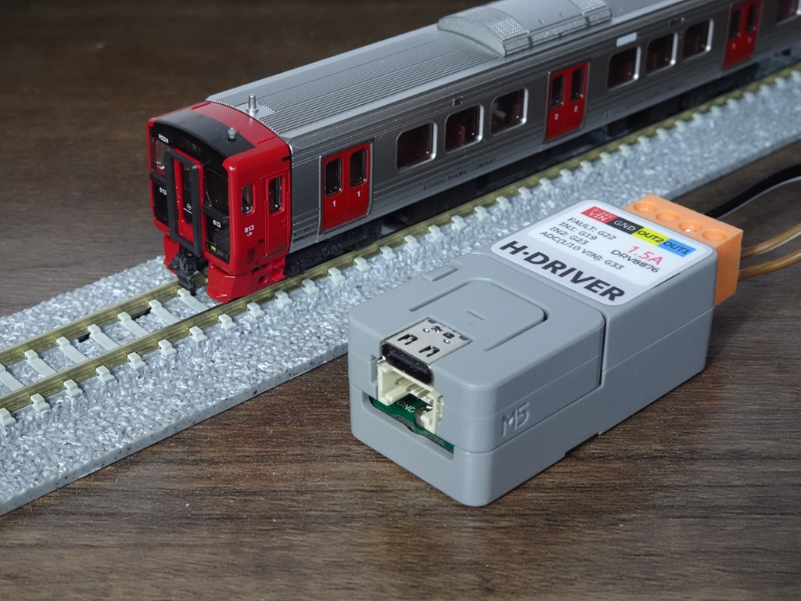

# RmppAtom (Rmpp : Railway Model Power Pack)
## Overview／概要
A compact power pack for N-scale railway models operated with a web browser using ATOM Lite. 
ATOM Liteを使用したWebブラウザで操作するコンパクトなNゲージ鉄道模型用パワーパックです。

## Features／特徴
- It is can run N-scale railway models by operating a web browser on a smartphone or other device. 
  スマートフォン等のWebブラウザの操作により、Nゲージ鉄道模型を走らせることができます。
- It is designed to be operated exclusively from a web browser, without switches or dials. By utilizing existing hardware products, it is easy to create power pack. 
  スイッチやダイヤルを省略し、Webブラウザからの操作専用の仕様です。既存のハードウェア製品を活用することで、パワーパックを容易に自作することが可能です。
- Achieves low cost and space saving by using SoC (Espressif Systems : ESP32) compatible with Wi-Fi standard. 
  Wi-Fi規格に対応したSoC(Espressif Systems : ESP32)を採用し、低コスト・省スペースを実現できます。
- Even if the SoC operation becomes unstable, safety is ensured by the motor driver IC with built-in overcurrent protection. 
  万が一SoCの動作が不安定になっても、過電流保護を内蔵したモータドライバICにより安全性を確保します。

## Block Diagram／ブロック図

## Specification Overview ／ 仕様概要
<table>
	<thead>
		<tr>
		<th colspan="2">Item／項目</th>
		<th>specification／仕様</th>
		</tr>
	</thead>
	<tbody>
		<tr>
		<td colspan="2">Rated Input Voltage 定格入力電圧</td>
		<td>DC12V</td>
		</tr>
		<tr>
		<td colspan="2">Rated Output Current 定格出力電流</td>
		<td>1.5A</td>
		</tr>
		<tr>
		<td rowspan="2">Output Control 出力制御</td>
		<td>Method 方式</td>
		<td>PWM (Frequency : 19kHz, Resolution : 12bit)</td>
		</tr>
		<tr>
		<td>Polarity 極性</td>
		<td>both directions (forward and reverse) 両方向（前進／後退）
		</tr>
		<tr>
		<td colspan="2">Display 表示</td>
		<td>RGB LED</td>
		</tr>
		<tr>
		<td colspan="2">Protections 保護</td>
		<td>built-in motor driver IC (over current, thermal shutdown) モータドライバIC内蔵（過電流、過熱）</td>
		</tr>
	</tbody>
</table>

## Requirement ／ 必要要件
### Hardware ／ ハードウェア
- ATOM Lite ESP32 IoT Development Kit 
 Product page : [shop.m5stack.com](https://shop.m5stack.com/products/atom-lite-esp32-development-kit)
- ATOMIC H-Bridge Driver Base (DRV8876) 
 Product page : [shop.m5stack.com](https://shop.m5stack.com/products/atomic-h-bridge-driver-base-drv8876)

### Software ／ ソフトウェア
#### Framework ／ フレームワーク
- Arduino
#### Development Environment ／ 開発環境
- VSCode & PlatformIO

## Usage ／ 使用方法
 As a sample, we provide pre-built binary files. By accessing the [https://rapid4mifu.github.io/](https://rapid4mifu.github.io/) from a browser that supports the Web Serial API (such as Chrome, Microsoft Edge, etc.), you can write the binary file to the ATOM Lite connected to your computer via Web Serial. Please refer to [Usage.md](USAGE_en.md) for other usage methods. 
 サンプルとして、ビルド済みのバイナリファイルを提供しています。ウェブシリアル機能に対応したブラウザ（Chrome、Microsoft Edge など）から [https://rapid4mifu.github.io/](https://rapid4mifu.github.io/) へアクセスし、パソコンに接続した ATOM Lite へウェブシリアル経由でバイナリファイルを書き込むことができます。その他の使用方法は、[Usage.md](USAGE_jp.md)を参照ください。

## License ／ ライセンス
This project is licensed under the MIT License. See the [LICENSE.md](LICENSE) file for details. 
このプロジェクトは MIT ライセンスの元にライセンスされています。 詳細は [LICENSE.md](LICENSE) をご覧ください。

## Author
[X(Twitter)](https://x.com/rapid_mifu)